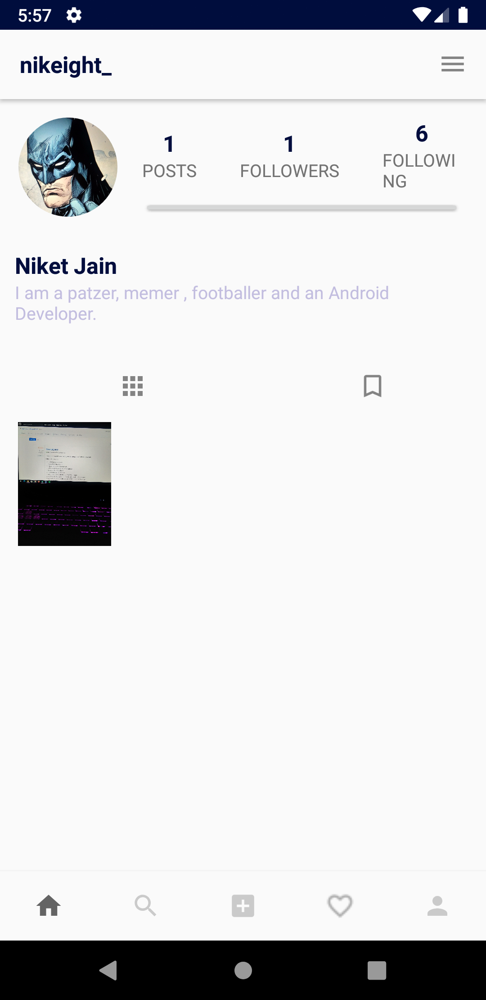
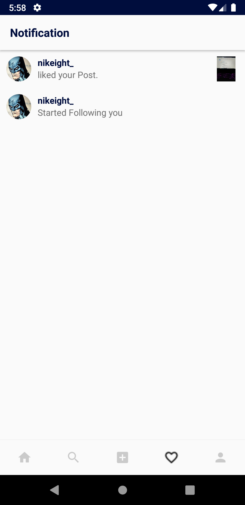
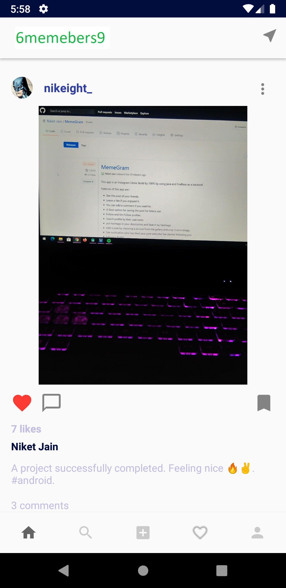

# Memegram
Clone of Instagram, but here users shares only meme. 🥳🌟

### Download 
You can download the apk from [here](https://github.com/Niket-Jain/MemeGram/releases/tag/v1.0.0).

### Contribute 
You can contribute to this repo by:
1. Fork this repo 🍴
2. Clone the repo to your machine. 👨‍💻
3. Submit your pull request. 🚀

### Preview 

  

  

  

### Upcoming features-
1- Chat with other users
2- Stories option (upload or view the stories)
3- Dark Mode
4- Biometric Auth
5- Offline Capabilities

